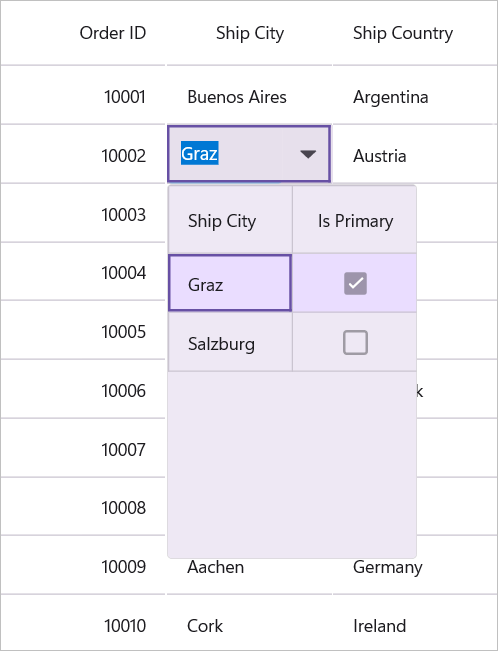
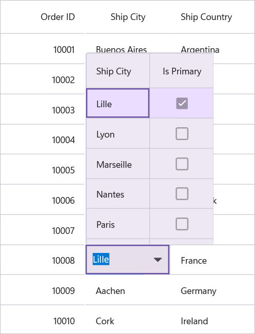

# How to load differnet items for each row in DataGridMultiColumn ComboBox Column in .NET MAUI DataGrid SfDataGrid

This example illustrates how to load different items for each row in multicolumn dropdown column in .NET MAUI DataGrid (SfDataGrid).

You can load different ItemsSource to each row of `DataGridMultiColumnComboBoxColumn` by setting the `SfDataGrid.ItemsSourceSelector` property.

## Implementing IItemsSourceSelector

`ItemsSourceSelector` needs to implement the `IItemsSourceSelector` interface, which is required to implement the `GetItemsSource` method. The `GetItemsSource` method receives the following parameters:

* **Record** – Data object associated with row.
* **Data Context** – Data context of data grid.

In the following code, ItemsSource for `ShipCity` column is returned based on `ShipCountry` column value using the record and data context of data grid passed to the `GetItemsSource` method.

## Xaml
```
<ContentPage.Resources>
    <local:ItemsSourceSelector x:Key="itemSourceSelector"/>
</ContentPage.Resources>

<syncfusion:SfDataGrid ItemsSource="{Binding Orders}"  
                       AllowEditing="True" 
                       SelectionMode="Single" 
                       AutoGenerateColumnsMode="None">
    <syncfusion:SfDataGrid.Columns>
        <syncfusion:DataGridNumericColumn MappingName="OrderID" HeaderText="Order ID" Format="D"/>
        <syncfusion:DataGridMultiColumnComboBoxColumn AutoGenerateColumnsMode="None"
                                                      DisplayMember="ShipCity"
                                                      HeaderText="Ship City"
                                                      ItemsSourceSelector="{StaticResource itemSourceSelector}"
                                                      MappingName="ShipCity"
                                                      ValueMember="ShipCity">
            <syncfusion:DataGridMultiColumnComboBoxColumn.Columns>
                <syncfusion:DataGridTextColumn HeaderText="Ship City" MappingName="ShipCity" />
                <syncfusion:DataGridCheckBoxColumn HeaderText="Is Primary" MappingName="IsPrimary" />
            </syncfusion:DataGridMultiColumnComboBoxColumn.Columns>
        </syncfusion:DataGridMultiColumnComboBoxColumn>
        <syncfusion:DataGridTextColumn MappingName="ShipCountry" HeaderText="Ship Country"/>
    </syncfusion:SfDataGrid.Columns>
</syncfusion:SfDataGrid>
```

## Xaml.cs
```
internal class ItemsSourceSelector : IItemsSourceSelector
{
    public IEnumerable GetItemsSource(object record, object dataContext)
    {
        if (record == null)
            return null;

        var orderinfo = record as Orders;
        var countryName = orderinfo.ShipCountry;

        var viewModel = dataContext as OrdersViewModel;

        //Returns ShipCity collection based on ShipCountry.
        if (viewModel.ShipCityItemsSources.ContainsKey(countryName))
        {
            ObservableCollection<ShipCityEntry> shipCities = null;
            viewModel.ShipCityItemsSources.TryGetValue(countryName, out shipCities);
            return shipCities.ToList();
        }

        return null;
    }
}
```

### ScreenShot

Here is the expected output when executing the sample:





[View sample in GitHub](https://github.com/SyncfusionExamples/How-to-load-different-items-for-each-row-in-MultiColumn-ComboBox-Column-in-.NET-MAUI-SfDataGrid)

 Take a moment to explore this [documentation](https://help.syncfusion.com/maui/datagrid/overview), where you can find more information about Syncfusion .NET MAUI DataGrid (SfDataGrid) with code examples. Please refer to this [link](https://www.syncfusion.com/maui-controls/maui-datagrid) to learn about the essential features of Syncfusion .NET MAUI DataGrid (SfDataGrid).

### Conclusion
I hope you enjoyed learning about How to implement select all checkbox column in SfDataGrid.

You can refer to our [.NET MAUI DataGrid’s feature tour](https://www.syncfusion.com/maui-controls/maui-datagrid) page to learn about its other groundbreaking feature representations. You can also explore our [.NET MAUI DataGrid Documentation](https://help.syncfusion.com/maui/datagrid/getting-started) to understand how to present and manipulate data. For current customers, you can check out our .NET MAUI components on the [License and Downloads](https://www.syncfusion.com/sales/teamlicense) page. If you are new to Syncfusion, you can try our 30-day [free trial](https://www.syncfusion.com/downloads/maui) to explore our .NET MAUI DataGrid and other .NET MAUI components.

If you have any queries or require clarifications, please let us know in the comments below. You can also contact us through our [support forums](https://www.syncfusion.com/forums),[Direct-Trac](https://support.syncfusion.com/create) or [feedback portal](https://www.syncfusion.com/feedback/maui?control=sfdatagrid), or the feedback portal. We are always happy to assist you!